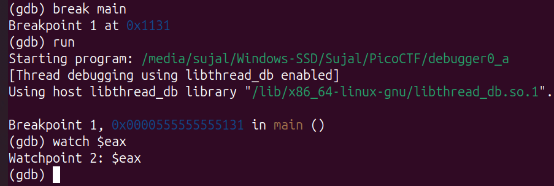
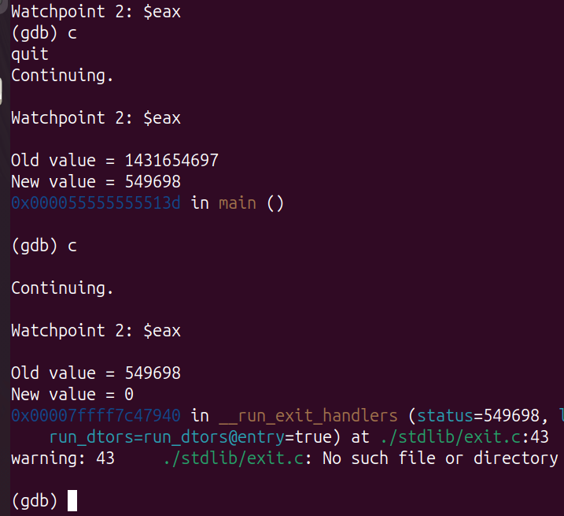
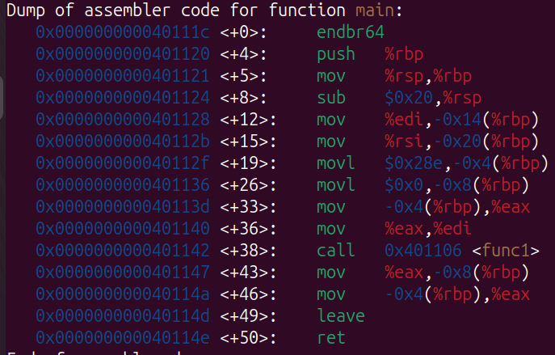

# GDB challenges

## GDB Baby Step 1
First we open the executable with gdb and run `info functions` to see what functions it has.


We need the value in eax at the end of main so let's put a watchpoint on this register so we can observe its value throughout the program.
But to begin we need to run the program so let's put a breakpoint at main and run it.


Now we can simply continue the program and see the value of eax at the end of main.


The final value of eax is 549698 so the flag is `picoCTF{549698}`

## GDB Baby Step 2
This time we will get the assembly code of the main function with the command `disassemble main`


We can set a breakpoint at the last instruction so that we can observe the value of eax at that point.


We print the value stored in eax with `p $eax` and see that it is 307019. So the flag is picoCTF{307019}.

## GDB Baby Step 3
First we get the assembly code for the main function with `disassemble main`


We see that the given constant is being loaded into `-0x4(%rbp)` which is `rbp-4`.

So we add a breakpoint just after the instruction where the constant was loaded into memory. Then we check the value stored at `rbp-4`. Since we need it in little endian and hexadecimal format we use the command given in the hint `x/4xb`.


So the flag is `picoCTF{0x6bc96222}`.

## GDB Baby Step 4
Get the assembly code of main.



There is no multiply instruction in the main function but just after a value is moved into `eax`, there is a call to the function `func1`. So let's examine this function's assembly code.


We see that there is an `imul` instruction where `eax` is multiplied by `0x3269`. Converting this number to decimal gives 12905.

So the flag is `picoCTF{12905}`.

## Crackmes - 1
First we run the program to see what it's about. It's simply asking for a key and validating it:

```
sujal:~/coding/Game_Hacking$ ./keyg3nme
Enter your key:  test
nope.
```

Let's open the executable in Ghidra.
The decompilation of main function is this:
```c
undefined8 main(void)

{
  int iVar1;
  long in_FS_OFFSET;
  undefined4 input_key;
  long local_10;
  
  local_10 = *(long *)(in_FS_OFFSET + 0x28);
  printf("Enter your key:  ");
  __isoc99_scanf(&DAT_0010201a,&input_key);
  iVar1 = validate_key(input_key);
  if (iVar1 == 1) {
    puts("Good job mate, now go keygen me.");
  }
  else {
    puts("nope.");
  }
  if (local_10 != *(long *)(in_FS_OFFSET + 0x28)) {
                    /* WARNING: Subroutine does not return */
    __stack_chk_fail();
  }
  return 0;
}
```

Clearly the key that we input is passed through the `validate_key` function so let's take a look at that.

It turns out to be as simple as this:
```c
bool validate_key(int param_1)

{
  return param_1 % 0x4c7 == 0;
}
```

`0x4c7` is `1223` in decimal so any key which is a multiple of this will work. And sure enough it does:

```bash
sujal:~/coding/Game_Hacking$ ./keyg3nme
Enter your key:  1223
Good job mate, now go keygen me.
```

## Crackme - 2
Run the program:

```
sujal:~/coding/Game_Hacking$ ./rev03
enter the magic string
test
wrong string
No flag for you.
```

Open the executable in Ghidra and look at the decompiled code of `main` function:

```c
undefined8 main(void)

{
  size_t sVar1;
  ulong uVar2;
  char local_98 [112];
  long local_28;
  int local_20;
  int local_1c;
  
  local_1c = 0;
  puts("enter the magic string");
  fgets(local_98,100,stdin);
  sVar1 = strlen(local_98);
  if (sVar1 < 0xc) {
    local_20 = 0;
    while( true ) {
      uVar2 = (ulong)local_20;
      sVar1 = strlen(local_98);
      if (sVar1 <= uVar2) break;
      local_1c = local_1c + local_98[local_20];
      local_20 = local_20 + 1;
    }
    if (local_1c == 1000) {
      local_28 = strcat_str();
      printf("flag is flag{");
      for (local_20 = 0; local_20 < 10; local_20 = local_20 + 1) {
        putchar((int)*(char *)(local_28 + local_20));
      }
      puts("}");
    }
    else {
      puts("wrong string\nNo flag for you.");
    }
  }
  else {
    puts("too long...sorry no flag for you!!!");
  }
  return 0;
}
```

The first block of code that catches my attention is:
```c
  local_1c = 0;
  puts("enter the magic string");
  fgets(local_98,100,stdin);
  sVar1 = strlen(local_98);
```
This tells us that `local_98` is the input string and `sVar` is its length. So let's rename these to `input_string` and `input_string_len`.

The next line is:
```c
if (input_string_len < 0xc){
```
`0xc` is `12` so our magic string needs to be less than 12 characters long.

Next we have this interesting loop:
```c
    local_20 = 0;
    while( true ) {
      uVar1 = (ulong)local_20;
      input_string_len = strlen(input_string);
      if (input_string_len <= uVar1) break;
      local_1c = local_1c + input_string[local_20];
      local_20 = local_20 + 1;
    }
```
Clearly `local_20` is a counter being incremented in each iteration so let's rename it to `i`.

`uVar1` is simply the counter typecasted to `ulong` so let's rename it `ulong_i`. Now the code looks like:

```c
    i = 0;
    while( true ) {
      ulong_i = (ulong)i;
      input_string_len = strlen(input_string);
      if (input_string_len <= ulong_i) break;
      local_1c = local_1c + input_string[i];
      i = i + 1;
    }
```

It looks like this block of code is just taking the sum of ascii values of all the characters in the string and storing it in `local_1c` so let's rename that to `ascii_sum`.

Now the very next block of code gives away how to get the flag:

```c
    if (ascii_sum == 1000) {
      local_28 = strcat_str();
      printf("flag is flag{");
      for (i = 0; i < 10; i = i + 1) {
        putchar((int)*(char *)(local_28 + i));
      }
      puts("}");
    }
    else {
      puts("wrong string\nNo flag for you.");
    }
```

So we just need to input a string such that the sum of ascii values of characters is 1000.  
At first I tried `~~~~~~~v` which does have a sum of 1000 but it didn't work. After some debugging (which is a bit of a challenge in itself since we only have assembly code to work with) I realised the problem is that when I press `Enter` the newline character also becomes a part of the string and it has an ascii value of `10`. So we replace `v` (ascii value 118) with `l` (ascii value 108) and it works!

```
sujal:~/coding/Game_Hacking$ ./rev03
enter the magic string
~~~~~~~l
flag is flag{!#&*/5<DMW}
```